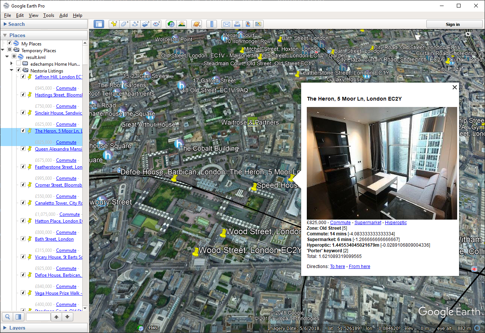

[](https://travis-ci.com/dechamps/kmlpipe)

# kmlpipe, a geographic data processing toolbox

kmlpipe is a framework to retrieve, aggregate, join, and otherwise process data
about geographic places. It was originally designed to rank London real estate
property listings according to specific criteria, but the core of the framework
is designed be reusable for a wide variety of use cases.

In some ways kmlpipe can be considered to be a
[Geographic Information System][]. Its interface is probably quite different
from a typical GIS, though. kmlpipe doesn't have a GUI and doesn't do anything
useful "out of the box": it merely provides a set of tools that are meant to
be assembled like Lego bricks to achieve a specific purpose.

Most kmlpipe tools read and write [KML][] files. Building a kmlpipe
application (also known as a *pipeline*) mostly involves piping these tools
into each other; hence the name "kmlpipe".


*Example output from the [edechamps Home Hunt][] pipeline, as shown in
[Google Earth](https://www.google.com/earth/). The pipeline retrieved thousands
of property listings by querying [Nestoria][] in 20 London areas, merged them,
widened them against other data sources (such as
[distance information from Google Maps][]), and ranked them. In this screenshot,
we can see that the pipeline gave [The Heron][], a building in Barbican, a high
score because of the area, quick commute time, proximity to a supermarket,
[Hyperoptic][] availability, and the presence of a concierge.*

## Dependencies

To test your system, run `test/run-scenarios`. If all the tests succeed, your
system has all the required and optional dependencies (with the possible
exception of `curl`, as tests never make external requests).

See [`dockerfiles/debian/Dockerfile`][] for a Docker image that provides all the
dependencies. That file also contains a canonical `apt` command to install all
the dependencies on a Debian system.

### Required dependencies

Most kmlpipe tools will not run unless the following is provided:

- A POSIX-based system, such as GNU/Linux.
- [bash][]. Note that a recent version (>= 4.4) is required, because kmlpipe
  relies on `${...@Q}` expansion as well as [improved empty array handling][].
- [xmlstarlet][].

### Optional dependencies

- [curl][] to make remote calls to external services, such as Google Maps.
- [jq][] to process data that comes in JSON form.

## Quick start

The best way to see kmlpipe in action is to run a real pipeline, for example by
taking the [edechamps Home Hunt][] pipeline for a [test run][].

## Components

kmlpipe tools are roughly organized into folders. Currently, these are:

- `util`: base tools for generic data manipulation. Frequently used by pipelines
  and other tools.
- `google`: tools for interacting with [Google Maps APIs][], such as searching
  for places or computing distances.
- `hyperoptic`: tools for importing [Hyperoptic site map][] data into kmlpipe.
- `nestoria`: tools for interacting with the [Nestoria API][], such as fetching
  property listings.
- `sainsburys`: tools for importing [Sainsbury's store map][] data into kmlpipe.

The repository is also meant to host finished kmlpipe applications, or
pipelines. Currently, the only pipeline is `edechamps-home-hunt` which
implements a London property search pipeline according to the author's
criteria. It is a good example of a real-world application built using kmlpipe.

## Fundamental principles and data model

A typical kmlpipe tool takes a KML file as input, processes it, and outputs
another KML file. KML is an [XML][] dialect; for this reason, most kmlpipe tools
are partially or entirely written in [XSLT][] 1.0, which is a language
specifically designed to transform XML documents according to a specific set of
rules.

In addition to XSLT scripts ("stylesheets" in XSLT parlance), bash is used to
chain tools together and to run tasks that XSLT is not well-suited for, such as
querying external services.

### KML format constraints

The [KML specification] is quite extensive and makes it possible to write KML
documents with a complex structure. Supporting arbitrary KML document structures
(e.g. nested folders) would make kmlpipe much harder to implement. To simplify
things, kmlpipe only really supports a *subset* of valid KML documents.
Specifically, kmlpipe will only correctly consume (and produce) KML documents
that abide by the following constraints:

- kmlpipe only uses the `Document`, `Folder`, `Placemark`, `Point` main KML
  elements. Other main elements are typically copied over as-is.
- kmlpipe only supports exactly one document topology: `Placemark` elements
  contained in `Folder` elements contained in a single `Document` element. Other
  structures are not supported. In particular, Placemarks that are at the root
  of the Document will be ignored by kmlpipe. Same for subfolders.

In other words, a typical KML document used in a kmlpipe pipeline will follow a
structure that looks like the following:

```xml
<kml xmlns="http://www.opengis.net/kml/2.2">
    <Document>
        <Folder>
            <name>Folder 1</name>
            <Placemark>
                <name>Placemark 1A</name>
                <Point><coordinates>11.1111,-11.1111</coordinates></Point>
                <!-- ... -->
            </Placemark>
            <Placemark>
                <name>Placemark 1B</name>
                <Point><coordinates>22.2222,-22.2222</coordinates></Point>
                <!-- ... -->
            </Placemark>
            <!-- ... -->
        </Folder>
        <Folder>
            <name>Folder 2</name>
            <Placemark>
                <name>Placemark 2A</name>
                <Point><coordinates>33.3333,-33.3333</coordinates></Point>
                <!-- ... -->
            </Placemark>
            <!-- ... -->
        </Folder>
    </Document>
</kml>
```

kmlpipe should output valid KML documents that can be opened in KML-enabled
software such as Google Earth or Google My Maps. The opposite, however, is not
always true, as such software can produce KML files that do not follow the
structure that kmlpipe expects. *Caveat emptor*.

### kmlpipe KML extensions

kmlpipe defines its own XML namespace, `http://edechamps.fr/kmlpipe` (henceforth
referred to using the `kmlpipe:` prefix), to extend KML with kmlpipe-specific
structured data. This namespace is used to carry around kmlpipe metadata that
does not have an obvious KML representation. For example, the `util/distance`
tool outputs computed distance information in `kmlpipe:Distance` elements. Note
that these extra elements can confuse third-party KML software, and might have
to be removed before such software can open KML files produced by kmlpipe.

Note that, in general, kmlpipe tools try to never permanently remove data from
a KML file. Even a tool like `util\remove-duplicates` will not actually remove
duplicate Placemarks; instead, it will move them inside some arbitrary kmlpipe
element, such that they become invisible to other kmlpipe tools (and most
third-party KML software, for that matter), but the data is technically still
there in the output KML file. The rationale is to make troubleshooting easier by
enabling traceability of KML elements as they are moved around by various
tools. Some tools provide an `obliterate` option to actually delete data, which
is primarily meant to improve performance with large KML files.

### Place IDs

Probably the most important kmlpipe-specific element is `kmlpipe:Place` and
in particular its `place-id` attribute. This element sits as a child of the KML
`Placemark` element and assigns a unique ID to the Placemark. It is similar
in purpose to the KML `id` attribute but is meant to be more robust and
(ideally) globally unique, such that it can unambiguously identify a specific
entry even between multiple KML files.

The main purpose of Place IDs is to simplify tool implementation, which can use
the ID as a string key to refer to any Placemark.

Most kmlpipe tools expect all Placemarks in the input KML file to have a
kmlpipe Place ID. kmlpipe tools that create Placemarks from scratch (e.g. from
the results of a Google Maps search) are responsible for coming up with an
appropriate Place ID for each Placemark that they generate.

The format of a kmlpipe place ID is a [URI][]. kmlpipe tools that generate new
Placemarks should choose a sensible URI prefix; aside from that, the format of
the URI is up to the tool that generates them. For example, Google Place Search
tools generate Place IDs in the form
`google-place-id:ChIJq7pi-GsDdkgR6azWnuyKtz8`, where
`ChIJq7pi-GsDdkgR6azWnuyKtz8` is the [Google Place ID][] of that specific place.
Place IDs are meant to be opaque strings and should not be parsed. Information
should be extracted from the contents of Placemark elements, not Place IDs.

### Links and Link Sets

Links are a very powerful concept in kmlpipe, as they make it possible to join
places together and then run tools that operate not on individual places, but on
*pairs* of places. The most obvious use case is to compute distances between
places.

A directed edge between two places is called a *Link*, represented by a
`kmlpipe:Link` element. The `place-id` attribute on that element indicates which
place the link points to. Links are themselves stored in a *Link Set*, stored
in a `kmlpipe:LinkSet` element. A Link Set is a direct child of a Placemark
element which represents the origin of all the links contained therein. A Link
Set element has a `name` attribute which identifies the Link Set for use in
tools.

Typically, a given Link Set name will appear in many places in a KML file. When a
Link Set name is specified to a tool, the tool will process all Link Sets of
that name in all the places in which it appears. Different Link Set names are
used to separate various types of Links such that they can be processed
separately from each other.

Here's an example of a KML file that uses Link Sets:

```xml
<kml
    xmlns="http://www.opengis.net/kml/2.2"
    xmlns:kmlpipe="http://edechamps.fr/kmlpipe"><Document>
    <Folder>
        <name>Folder 1</name>
        <Placemark>
            <name>Placemark 1</name>
            <kmlpipe:Place place-id="p1" />
            <kmlpipe:LinkSet name="Link Set X">
                <kmlpipe:Link place-id="p2" />
                <kmlpipe:Link place-id="p3" />
            </kmlpipe:LinkSet>
            <kmlpipe:LinkSet name="Link Set Y">
                <kmlpipe:Link place-id="p3" />
                <kmlpipe:Link place-id="p4" />
            </kmlpipe:LinkSet>
        </Placemark>
        <Placemark>
            <name>Placemark 2</name>
            <kmlpipe:Place place-id="p2" />
            <kmlpipe:LinkSet name="Link Set X">
                <kmlpipe:Link place-id="p1" />
                <kmlpipe:Link place-id="p3" />
            </kmlpipe:LinkSet>
        </Placemark>
        <Placemark>
            <name>Placemark 3</name>
            <kmlpipe:Place place-id="p3" />
        </Placemark>
        <Placemark>
            <name>Placemark 4</name>
            <kmlpipe:Place place-id="p4" />
            <kmlpipe:LinkSet name="Link Set Y">
                <kmlpipe:Link place-id="p1" />
            </kmlpipe:LinkSet>
        </Placemark>
    </Folder>
</Document></kml>
```

This example defines the following Link Sets:

- `Link Set X`
  - `p1` → `p2`
  - `p1` → `p3`
  - `p2` → `p1`
  - `p2` → `p3`
- `Link Set Y`
  - `p1` → `p3`
  - `p1` → `p4`
  - `p4` → `p1`

Link Sets and Links do nothing useful on their own, but some tools use them as
the basis for computations. For example, running the `util/distance` tool on the
above file for a specific Link Set name will generate an output where each Link
element is augmented with a Distance element that contains the distance between
the places at both ends of the Link.

More generally, running kmlpipe tools that operate on *pairs* of places is
usually a three-step process:

1. Generate Links for the pairs of places that you care about (e.g. using
   `util/link-folders`);
2. Run the tool to do the actual computation (e.g. `util/distance`) with the
   name of the Link Sets you just created;
3. Extract the data (e.g. distance information) that the tool added to each Link
   element.

kmlpipe provides a number of off-the-shelf Link-related tools that, when
combined, can solve surprisingly complex problems. For example, if you have a
list of potential houses, and a list of supermarkets, a typical question to ask
is "how far away is each house from its *nearest* supermarket?". In kmlpipe,
assuming there is one Folder that contains the houses and another that contains
the supermarkets, answering that question is as simple as running
`util/link-folders`, `util/distance`, `util/distance-sort`, and
`util/link-truncate`, one after the other. The resulting file will contain, for
each house, a single Link that points to the nearest supermarket, along with its
distance to the house.

## Practical considerations

To simplify tool implementation, and to reduce the likelihood of invalid calls,
kmlpipe is very strict and opinionated about command line parsing. Command line
options must be specified as `--option value`; `--option=value` will not work.
Non-option arguments must always come after a `--` separator; e.g.
`util/lskml example.kml` won't work, but `util/lskml -- example.kml` will.

Set the `KMLPIPE_DEBUG` environment variable to increase log verbosity. Set the
`KMLPIPE_QUIET` environment variable to decrease log verbosity.

kmlpipe tools that want to use the current time will get it from the system
clock, unless the `KMLPIPE_TIMESTAMP` environment variable is set, in which
case they will use that as the current Unix timestamp. Just like the replay
system described below, this can improve repeatability of runs by reducing the
influence of the external environment.

### External requests and replay system

All external HTTP requests made by kmlpipe (e.g. to query Google Maps) go
through `util/fetch`, which is a wrapper around curl. The main purpose of this
wrapper is to make it possible to store and replay requests using the
`KMLPIPE_FETCH_REPLAY_DIR` environment variable. The way this works is that each
HTTP request (including all parameters) is stored in a file, and the
corresponding response is stored alongside it. If `util/fetch` is called again
with an identical request, curl is not called and the response is served from
the replay file instead.

This system can be very useful both for development and production pipeline runs
for the following reasons:

- During development, it can be used to easily inspect external requests and
  responses, and even run a tool with a simulated response.
- In production, it can be used to help troubleshoot pipelines after-the-fact.
  It also makes it possible to re-run an entire pipeline with the guarantee that
  external calls will return the exact same data, so that pipelines can be
  re-run in the exact same conditions as the first run.
- When re-running tools and pipelines, the replay system can be used as a cache
  to avoid repeatedly sending queries that were answered previously. This is
  especially useful with services like Google Maps where each additional query
  can cost actual money. (`util/cache` can also be used for more robust
  caching.)
- This feature is also used in the kmlpipe test suite to ensure tests never have
  to send external requests (hermeticity).

See the usage information in `util/fetch` for more information about this feature.

## Testing

kmlpipe comes with a full test suite that covers almost every single tool and
even large parts of the bundled pipelines. The test suite can be found in the
`test` directory. To run the test suite, run `test/run-scenarios`. Individual
scenarios can be run from `test/scenarios/.../run`.

A typical test scenario calls a tool with a given input, and compares the output
with a "golden" expected output. (This is commonly known as a "change detector"
test.) If the test fails because of changes in the output, but the changes are
deliberate, the test can be made to pass again by running it with the
`KMLPIPE_REGOLDEN` environment variable set, which instructs the test to
regenerate its golden output.

A more complicated case is when the tool under test makes external requests. In
that case, the replay system (see above) is used to simulate the external
service. This ensures tests are self-contained, repeatable, deterministic and do
not depend on the availability of the external service. In fact, tests always
run with `KMLPIPE_HERMETIC` set, which means external requests will fail if
there is no corresponding replay file. When making changes to replay request
files, `util/fetch-replay-fix` can be used to easily regenerate the request
hashes.

## Caveats, limitations, areas for improvement

Writing a kmlpipe tool or pipeline requires skills in advanced bash scripting
and XSLT. XSLT in particular is an obscure language that is unusual in many
respects and has a fairly steep learning curve.

The set of currently available kmlpipe tools is mostly geared towards a very
specific use case: searching for London properties according to the kmlpipe
author's (fairly contrived) criteria. While kmlpipe was designed as a generic
framework that can accommodate a wide variety of use cases, using kmlpipe in a
very different context is likely to require some non-trivial amount of
groundwork, for example adding new data sources.

KML coordinates are `longitude,latitude` (e.g. Buckingham Palace in London is
at `-0.141,51.501`). This can lead to surprises, because pretty much
everything else uses the opposite order of `latitude,longitude` (e.g.
`51.501,-0.141`). Care should be taken when interacting with external
services, such as Google Maps, that use the opposite order.

The author worked on kmlpipe on and off over the course of a year. This is a
pet project done on the author's free time with limited resources, mostly to
help the author find a place to live. As a result, the framework is somewhat
unpolished and contains some rough edges. These include, among other things,
inconsistencies in file formatting, code style (e.g. structure of XSLT
stylesheets), naming conventions, tool expectations (e.g. some tools assume the
specified Folders or Link Sets don't already exist in the input, while others
assume the opposite), gaps in error handling and test coverage, etc. Patches to
improve this state of affairs are more than welcome.

kmlpipe can handle reasonably large KML files, but most tools struggle to
scale to really huge files. Some of the XSLT processing in kmlpipe is
suspected to have O(n²) complexity in many cases, which limits kmlpipe's
ability to run quickly (and within reasonable memory limits) on files that
contain more than a few thousands of places.

[bash]: https://www.gnu.org/software/bash/
[curl]: https://curl.haxx.se/
[`dockerfiles/debian/Dockerfile`]: dockerfiles/debian/Dockerfile
[distance information from Google Maps]: https://developers.google.com/maps/documentation/distance-matrix/
[edechamps Home Hunt]: edechamps-home-hunt/
[Geographic Information System]: https://en.wikipedia.org/wiki/Geographic_information_system
[KML specification]: https://developers.google.com/kml/documentation/kmlreference
[jq]: https://stedolan.github.io/jq/
[Google Maps APIs]: https://developers.google.com/maps/documentation/
[Google Place ID]: https://developers.google.com/places/place-id
[Hyperoptic]: https://www.hyperoptic.com/
[Hyperoptic site map]: https://www.hyperoptic.com/map/
[improved empty array handling]: https://stackoverflow.com/a/39687362
[KML]: https://en.wikipedia.org/wiki/Keyhole_Markup_Language
[Nestoria]: https://www.nestoria.co.uk/
[Nestoria API]: https://www.nestoria.co.uk/help/api
[Sainsbury's Store Map]: https://stores.sainsburys.co.uk/
[test run]: edechamps-home-hunt/#running-the-pipeline
[The Heron]: https://goo.gl/maps/VZovR2oeUQZCFSxZ9
[xmlstarlet]: http://xmlstar.sourceforge.net/
[XML]: https://en.wikipedia.org/wiki/XML
[XSLT]: https://en.wikipedia.org/wiki/XSLT
[URI]: https://en.wikipedia.org/wiki/Uniform_Resource_Identifier