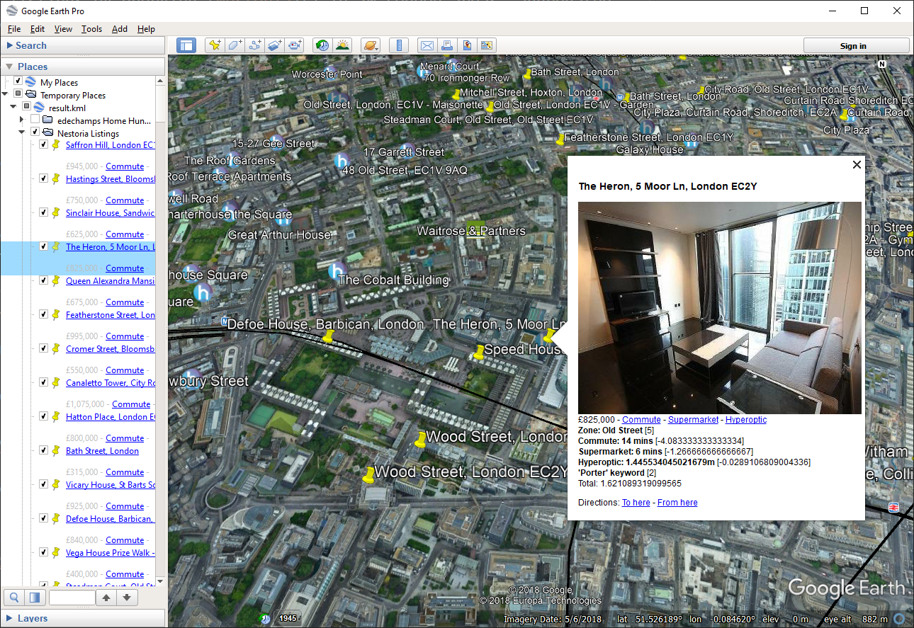

# edechamps Home Hunt pipeline

*edechamps Home Hunt* (EHH) is a geographic data processing application
(pipeline) built within the [kmlpipe][] framework. The goal of the pipeline is
to help Etienne Dechamps (the author of this pipeline and of kmlpipe in
general), faced with the huge sprawling mess that is the London property market,
find a place to live according to his specific personal criteria. Hopefully
this can be useful to other people who would like to follow a similar approach.

The pipeline is designed to automate the following tasks:

- Gather data about supermarkets in London, being careful to exclude small 
  convenience stores (`get-supermarkets` stage);
- Gather data about [Hyperoptic][]-enabled buildings (`get-hyperoptic` stage);
- Fetch and merge property listings from a given set of about 20 weighted areas
  (zones) in London (`get-listings` stage);
- Only keep new properties that did not already appear in a previous run of the
  pipeline;
- For each property, compute the real transit time to the workplace using public
  transport, the real walking time to the nearest supermarket, and the distance
  to the nearest Hyperoptic-enabled site (`widen` stage);
- For each property, compute a score based on all the information gathered so
  far and the given keywords, weights and thresholds (`compute-partial-scores`,
  `compute-total-scores` stages);
- Finally, sort the resulting property list by score and format the results for
  presentation in a KML viewer such as Google Earth (`present` stage).

[![EHH flow diagram][diagram]][diagram]

In the end, the results look like this:



## Running the pipeline

To run the pipeline on a small number of properties for a quick test, use the
following procedure:

1. Make sure kmlpipe is fully operational, i.e. `test/run-scenarios` succeeds
   and curl is installed.
2. Create or reuse a [Google Cloud project][] and enable the [Google Places][]
   and [Google Distance Matrix][] APIs. Get the [API key].
   - Note: running the EHH pipeline in test mode should only result in a very
     small number of Google Maps API requests - much smaller than what the free
     quota allows. Nevertheless, if you're paranoid about being billed actual
     money, feel free to [set your own quotas][].
4. Run:
   ```shell
   mkdir cache
   edechamps-home-hunt/run \
       --google-key =<YOUR GOOGLE API KEY> --cache-directory cache > result.kml
   ```
     - Note: this can take a few minutes to run and uses a sizable amount of 
       RAM. This is because the Hyperoptic data contains thousands of places,
       making it expensive to process, even with a small number of properties.
5. Open `result.kml` in a KML viewer, preferably [Google Earth Pro][].

With the above command, the EHH pipeline will run in "test" mode, which only
fetches a total of 10 properties in 2 zones. To run the full pipeline (thousands
of properties in 20 zones), use the `--production` flag. Note that this takes
much longer and can make a sizeable dent in your Google API free quota.
Subsequent runs are much cheaper thanks to the cache.

[API key]: https://console.cloud.google.com/apis/credentials
[Google Cloud project]: https://console.cloud.google.com/
[Google Distance Matrix]: https://console.cloud.google.com/marketplace/details/google/distance-matrix-backend.googleapis.com
[Google Earth Pro]: https://www.google.com/earth/download/gep/agree.html
[Google Places]: https://console.cloud.google.com/marketplace/details/google/places-backend.googleapis.com
[Hyperoptic]: https://www.hyperoptic.com/
[kmlpipe]: ..
[set your own quotas]: https://console.cloud.google.com/iam-admin/quotas

<!-- Use the converter at http://http://gravizo.com/ to recover the source code
of this graph. -->
[diagram]: https://g.gravizo.com/svg?digraph%20G%20%7B%0A%09rankdir%3D%22LR%22%0A%09node%5Bfontname%3D%22sans-serif%22%5D%0A%0A%20%20%20%20GoogleMapsDistance%5Blabel%3D%22Google%20Maps%5CnDistance%20API%22%5D%0A%20%20%20%20GoogleMapsPlaces%5Blabel%3D%22Google%20Maps%5CnPlace%20Search%20API%22%5D%0A%20%20%20%20Sainsburys%5Blabel%3D%22Sainsbury's%20Data%22%5D%0A%20%20%20%20GetSupermarkets%5Blabel%3D%22get-supermarkets%20stage%22%5D%0A%20%20%20%20Hyperoptic%5Blabel%3D%22Hyperoptic%20Data%22%5D%0A%20%20%20%20GetHyperoptic%5Blabel%3D%22get-hyperoptic%20stage%22%5D%0A%20%20%20%20Nestoria%5Blabel%3D%22Nestoria%20API%22%5D%0A%20%20%20%20ZoneList%5Blabel%3D%22Zone%20list%22%5D%0A%20%20%20%20GetListings%5Blabel%3D%22get-listings%20stage%22%5D%0A%20%20%20%20ListingsDiff%5Blabel%3D%22Listings%20diff%22%5D%0A%20%20%20%20Widen%5Blabel%3D%22widen%20stage%22%5D%0A%20%20%20%20Keywords%5Blabel%3D%22Keywords%22%5D%0A%20%20%20%20ComputePartialScores%5Blabel%3D%22compute-partial-scores%20stage%22%5D%0A%20%20%20%20ComputeTotalScores%5Blabel%3D%22compute-total-scores%20stage%22%5D%0A%20%20%20%20Present%5Blabel%3D%22present%20stage%22%5D%0A%20%20%20%20%0A%20%20%20%20GoogleMapsPlaces%20-%3E%20GetSupermarkets%0A%20%20%20%20Sainsburys%20-%3E%20GetSupermarkets%0A%20%20%20%20Hyperoptic%20-%3E%20GetHyperoptic%0A%20%20%20%20Nestoria%20-%3E%20GetListings%0A%20%20%20%20ZoneList%20-%3E%20GetListings%0A%20%20%20%20GetListings%20-%3E%20ListingsDiff%0A%20%20%20%20ListingsDiff%20-%3E%20Widen%0A%20%20%20%20GetSupermarkets%20-%3E%20Widen%0A%20%20%20%20GetHyperoptic%20-%3E%20Widen%0A%20%20%20%20GoogleMapsDistance%20-%3E%20Widen%0A%20%20%20%20Widen%20-%3E%20ComputePartialScores%0A%20%20%20%20Keywords%20-%3E%20ComputePartialScores%0A%20%20%20%20ComputePartialScores%20-%3E%20ComputeTotalScores%0A%20%20%20%20ComputeTotalScores%20-%3E%20Present%0A%7D%0A